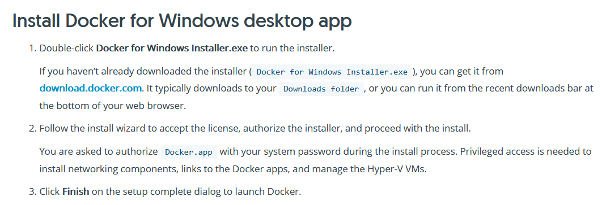
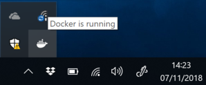
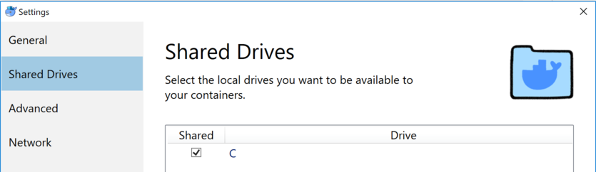

# Installation de Docker sous Windows

Ouvrez un navigateur web à l'adresse <https://docs.docker.com/docker-for-windows/install/#about-windows-containers>

Dans la section *Install Docker for Windows desktop app*, cliquez sur le lien *download.docker.com*.

Une fois téléchargée, lancez l'application *Docker for Windows Installer*.

Autorisez l'application à apporter des mofifications à votre appareil.

Cochez *Add shortcut to desktop* puis cliquez sur *OK*.

Cliquez enfin sur *Close and log out*. Votre machine va redémarrer.

Docker va se lancer automatiquement et va activer *Hyper-V* et les *Containers features* pour vous. Validez cette étape. La machine va (encore) redémarrer. Patientez un peu.

Au redémarrage, Docker va se lancer. Une icône en forme de baleine va apparaître en bas à droite de l'écran. Docker est fonctionnel lorsque la baleine est blanche et statique.

## Configuration

Vous aurez besoin d'autoriser Docker à accéder au disque *C*. Pour cela, cliquez-droit sur l'icône de Docker puis sélectionnez *Settings* puis *Shared Drives*. Cochez alors la case à côté de *C*, cliquez sur *Apply*. Entrez votre mot de passe Windows puis validez encore une fois.

Si vous avez besoin de modifier la quantité de mémoire vive disponible, cliquez-droit sur l'icône de Docker puis sélectionnez *Settings* puis *Advanced*.
